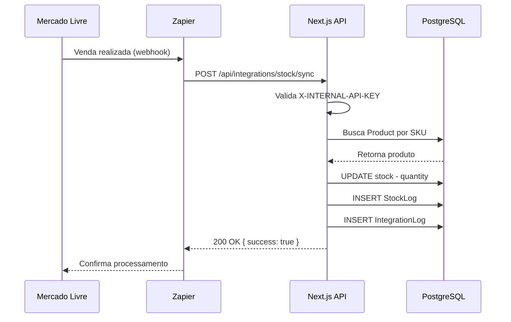

# 📐 ARQUITETURA DO SISTEMA

## Visão Geral da Arquitetura

```
┌─────────────────────────────────────────────────────────────────┐
│                    CAMADA DE APRESENTAÇÃO                        │
│  ┌──────────────┐  ┌──────────────┐  ┌──────────────┐          │
│  │   CUSTOMER   │  │    ADMIN     │  │    OWNER     │          │
│  │   (Loja)     │  │  (Gestão)    │  │ (Financeiro) │          │
│  └──────┬───────┘  └──────┬───────┘  └──────┬───────┘          │
└─────────┼──────────────────┼──────────────────┼──────────────────┘
          │                  │                  │
          └──────────────────┴──────────────────┘
                             │
┌─────────────────────────────┴────────────────────────────────────┐
│                    CAMADA DE ROTEAMENTO                           │
│  ┌─────────────────────────────────────────────────────┐         │
│  │  Next.js App Router (Server Components)            │         │
│  │  - (shop) → Rotas públicas                         │         │
│  │  - (auth) → Login/Registro                         │         │
│  │  - admin → Protegido ADMIN/OWNER                   │         │
│  │  - admin/financial → Protegido OWNER               │         │
│  └─────────────────────────────────────────────────────┘         │
└──────────────────────────┬───────────────────────────────────────┘
                           │
┌──────────────────────────┴────────────────────────────────────────┐
│                 CAMADA DE SEGURANÇA                                │
│  ┌──────────────────┐         ┌──────────────────┐               │
│  │  Middleware.ts   │         │  NextAuth v5     │               │
│  │  - RBAC Guards   │◄────────┤  - JWT Session   │               │
│  │  - API Key Check │         │  - Google OAuth  │               │
│  │                  │         │  - Credentials   │               │
│  └──────────────────┘         └──────────────────┘               │
└──────────────────────────┬───────────────────────────────────────┘
                           │
┌──────────────────────────┴────────────────────────────────────────┐
│                   CAMADA DE APLICAÇÃO                              │
│  ┌─────────────────────┐       ┌─────────────────────┐           │
│  │  Server Actions     │       │  API Routes         │           │
│  │  - createProduct()  │       │  /api/admin/*       │           │
│  │  - updateOrder()    │       │  /api/integrations/*│           │
│  │  - applyCoupon()    │       │                     │           │
│  └─────────────────────┘       └─────────────────────┘           │
└──────────────────────────┬───────────────────────────────────────┘
                           │
┌──────────────────────────┴────────────────────────────────────────┐
│                    CAMADA DE DADOS                                 │
│  ┌─────────────────────────────────────────────────────┐          │
│  │  Prisma ORM                                         │          │
│  │  - Type-safe queries                                │          │
│  │  - Migrations                                       │          │
│  │  - Relations                                        │          │
│  └─────────────────┬───────────────────────────────────┘          │
└────────────────────┼──────────────────────────────────────────────┘
                     │
┌────────────────────┴──────────────────────────────────────────────┐
│                 CAMADA DE PERSISTÊNCIA                             │
│  ┌─────────────────────────────────────────────────────┐          │
│  │  PostgreSQL 16                                      │          │
│  │  - JSONB (specs, shippingAddress)                  │          │
│  │  - Full-text search                                │          │
│  │  - Indexes (sku, slug, email)                      │          │
│  └─────────────────────────────────────────────────────┘          │
└───────────────────────────────────────────────────────────────────┘
```

---

## Fluxos Principais

### 1. Fluxo de Autenticação (OAuth + Credentials)

```
┌─────────┐
│ Cliente │
└────┬────┘
     │
     │ 1. Clica "Login com Google"
     ▼
┌──────────────┐
│ NextAuth     │
│ Redirect     │
└──────┬───────┘
       │ 2. Redireciona para Google
       ▼
┌──────────────┐
│ Google OAuth │
└──────┬───────┘
       │ 3. Usuário autoriza
       ▼
┌──────────────┐
│ NextAuth     │
│ Callback     │◄────── 4. Google retorna code
└──────┬───────┘
       │ 5. Troca code por tokens
       │ 6. Busca/cria usuário no DB
       ▼
┌──────────────┐
│ Cria Session │
│ JWT (Cookie) │
└──────┬───────┘
       │ 7. Redireciona para app
       ▼
┌─────────────┐
│ Dashboard   │
└─────────────┘
```

### 2. Fluxo de Integração (Estoque ML → Loja)

```
┌────────────────┐
│ Mercado Livre  │ (Venda realizada)
└───────┬────────┘
        │
        │ 1. Webhook ou Zapier
        ▼
┌────────────────────┐
│ POST /api/         │
│ integrations/      │
│ stock/sync         │
│ Headers:           │
│ X-INTERNAL-API-KEY │
└───────┬────────────┘
        │ 2. Validação Middleware
        ▼
┌────────────────────┐
│ Zod Validation     │
│ { sku, quantity,   │
│   source }         │
└───────┬────────────┘
        │ 3. Busca Product por SKU
        ▼
┌────────────────────┐
│ Prisma Update      │
│ product.stock      │
│ = newQuantity      │
└───────┬────────────┘
        │ 4. Cria StockLog
        ▼
┌────────────────────┐
│ StockLog.create()  │
│ { source: ML,      │
│   previousQty,     │
│   newQty }         │
└───────┬────────────┘
        │ 5. Cria IntegrationLog
        ▼
┌────────────────────┐
│ IntegrationLog     │
│ (auditoria)        │
└───────┬────────────┘
        │ 6. Retorna 200 OK
        ▼
┌────────────────────┐
│ { success: true,   │
│   product: {...} } │
└────────────────────┘
```

### 3. Fluxo de Compra (Cliente)

```
┌─────────┐
│ Cliente │
└────┬────┘
     │ 1. Adiciona produtos ao carrinho
     ▼
┌──────────────┐
│ Cart Session │ (localStorage + DB se autenticado)
└──────┬───────┘
     │ 2. Preenche dados de entrega
     ▼
┌──────────────┐
│ Checkout     │
│ - Frete calc │
│ - Cupom      │
└──────┬───────┘
     │ 3. Finaliza pedido
     ▼
┌──────────────┐
│ Server Action│
│ createOrder()│
└──────┬───────┘
     │ 4. Valida estoque
     │ 5. Aplica cupom
     │ 6. Calcula total
     ▼
┌──────────────┐
│ Order.create │
│ OrderItem[]  │
└──────┬───────┘
     │ 7. Atualiza estoque (decremento)
     ▼
┌──────────────┐
│ StockLog[]   │
└──────┬───────┘
     │ 8. Envia email confirmação
     ▼
┌──────────────┐
│ SMTP (Mail)  │
└──────┬───────┘
     │ 9. Retorna orderNumber
     ▼
┌──────────────┐
│ Página       │
│ Confirmação  │
└──────────────┘
```

---

## Padrões de Design Utilizados

### 1. **Singleton Pattern**
- **Prisma Client**: única instância global
- **Axios Instance**: configuração centralizada com interceptors
- **FinancialConfig**: tabela com 1 única linha

### 2. **Repository Pattern**
- Abstração de acesso ao banco via Prisma
- Facilita testes e manutenção

### 3. **Middleware Chain**
- NextAuth → Middleware RBAC → Route Handler
- Validação em camadas

### 4. **Observer Pattern (Logs)**
- Eventos de estoque/integração disparam logs automáticos
- Auditoria completa

### 5. **Factory Pattern (Seed)**
- Geração de dados de teste de forma programática

---

## Segurança em Profundidade

### Camadas de Proteção

1. **Frontend (UI)**
   - Validação de formulários com React Hook Form + Zod
   - Disable de botões durante loading (prevent double submit)

2. **Routing (Middleware)**
   - Verificação de sessão antes de acessar rotas admin
   - Redirect se não autorizado

3. **API Routes**
   - Revalidação de sessão
   - Zod schema validation no body
   - Try/catch com logs de erro

4. **Database**
   - Unique constraints (email, sku, orderNumber)
   - Foreign keys (onDelete: Cascade)
   - Indexes para performance

5. **Environment Variables**
   - Secrets nunca commitados (.gitignore)
   - Validação de env vars obrigatórias no startup

---

## Escalabilidade

### Horizontal Scaling

- **Next.js**: pode rodar em múltiplas instâncias (Vercel, AWS Lambda)
- **PostgreSQL**: suporta read replicas
- **Prisma**: connection pooling nativo

### Caching Strategy

- **Server Components**: cache automático do Next.js
- **Static Generation**: páginas de categoria podem ser ISR
- **API Responses**: adicionar Redis para cache de produtos (futuro)

### Database Optimization

- **Indexes**: criados em colunas frequentemente buscadas
  ```prisma
  @@index([sku])
  @@index([slug])
  @@index([email])
  ```

- **Pagination**: todas as listagens usam `skip` e `take`

- **Select apenas campos necessários**: reduz payload

---

## Monitoramento e Observabilidade

### Logs Estruturados

```typescript
console.error('[STOCK SYNC ERROR]', {
  sku: data.sku,
  source: data.source,
  error: error.message,
  timestamp: new Date().toISOString(),
});
```

### Tabelas de Auditoria

- **IntegrationLog**: todas as chamadas API
- **ActivityLog**: ações de usuários (CRUD)
- **StockLog**: mudanças de estoque

### Métricas (Futuro)

- Integração com Sentry para error tracking
- Dashboard de Analytics (Metabase ou similar)
- Alerts via Webhook (Discord/Slack)

---

## Diagramas de Sequência

### Sincronização de Estoque (ML)



---

## Considerações de Performance

### Frontend
- **Code Splitting**: Next.js divide JS por rota
- **Image Optimization**: Next.js Image component (WebP, lazy load)
- **Lazy Loading**: Componentes pesados carregam sob demanda

### Backend
- **Prepared Statements**: Prisma usa por padrão (SQL injection safe)
- **Connection Pooling**: configurado no DATABASE_URL
- **Parallel Queries**: `Promise.all()` quando queries são independentes

### Database
- **JSONB Indexes**: para buscar em campos `specs`
  ```sql
  CREATE INDEX product_specs_voltagem 
  ON products USING gin ((specs->'voltagem'));
  ```

---

**Documentação técnica completa**. Para guia de uso, veja [README.md](README.md).
